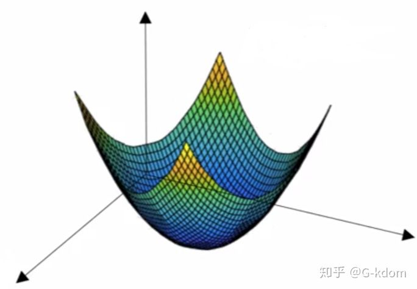
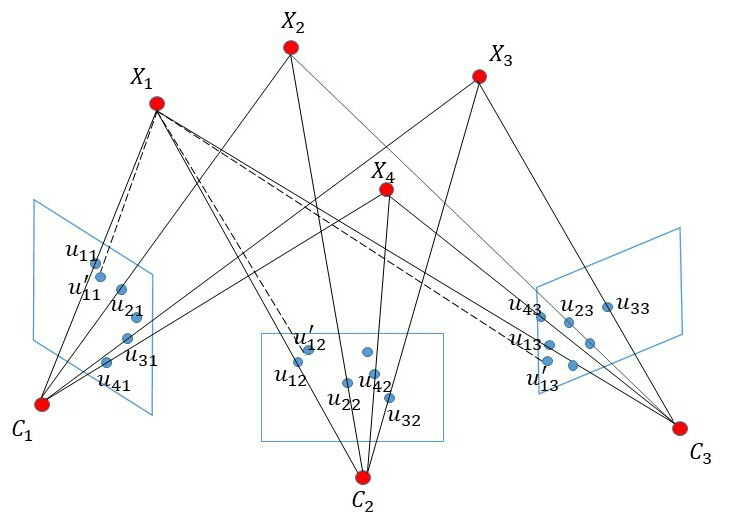

# Robust Optimization in 3D Vision

## 1. 凸优化和非凸优化

凸优化问题的一般形式

$$
\mathop{min}\quad f(x) \qquad\qquad\qquad\qquad\\
s.t.\quad h_i(x) = 0, \forall i = 1,\cdots, n\\
\qquad\quad g_j(x) < 0, \forall j = 1, \cdots, m
\tag{1}
$$
其中 $f(x), g_j(x)$ 都是凸函数，$h_i(x)$ 为仿射函数(既是凸函数又是凹函数)。

### 1.1 凸函数

凸函数的定义:
对于定义在凸集上的函数$f$，如果对任意 $0 \leq \theta \leq 1$，都有
$$
f(\theta x + (1 - \theta) y) \leq \theta f(x) + (1 - \theta) f(y) \tag{2}
$$

一个简单的例子: 对于下图，函数任意两点之间的弦都在函数的上方。

以及更高维空间中的凸函数

但是实际中，要验证一个函数是否是凸函数，这个定义很不好用。因此，存在一些其他方法判断是否是凸函数。

#### (1) 导数和二阶信息判断

对于一个光滑的函数(几乎处处可导)，可通过以下导数信息判断:

(一阶充要条件) $f(y) \geq f(x) + \nabla f(x)^T (y - x)$
(二阶充要条件) $\nabla^2 f(x) \geq 0$

#### (2) 利用凸函数的结构叠加性质

另一类有用的方法就是可以利用凸函数的一些结构叠加性质来判断这些函数是否是凸函数复合而成。

- 非负加权求和: $f(x) = \sum_i \alpha_if_i(x), \forall \alpha_i \geq 0$

- 仿射变换: $f(x) = f_i(Ax + b)$

- 取最大值: $f(x) = max\{f_1(x), \cdots, f_m(x)\}$

- 标量复合, 向量复合, 最小化 ...

### 1.2 非凸函数

凸函数(凹函数，拟凸函数)的一个对立就是非凸函数。凸函数的一个好处就是，对于优化得到的局部最优点，一定是一个全局最优点，因为凸函数只存在一个全局最优。而对于非凸函数，则存在非常多的局部最优点，还有非常多的鞍点。如下图所示:

对于非凸优化问题，当优化算法收敛的时候，不利用其他信息，很难判断是否收敛到全局最优。因而非凸优化问题的求解要想尽可能的逼近全局最优，需要有较为可靠的初始值。很不幸的是，我们面临的大多数问题都是非凸优化问题。

## 2. 梯度法求解数值优化问题

## 3. $l_1$-范数 VS $l_2$-范数

对于优化问题，我们通常想要最小化估计值 $f(x)$ 和目标值 $y$ 之间的残差(residual)

$$
\mathop{min} d(y, f(x))^p　\tag{}
$$

其中，$d(,)^p$ 表示误差度量的范数。对于向量来说，常见的有 $l_1$-范数、$l_2$-范数。
如果是 $l_1$-范数，残差是目标值和估计值之差的绝对值之和:

$$
S = \sum_{i=1}^n |y_i - f(x_i)| \tag{}
$$

如果是 $l_2$-范数，残差是目标值和估计值之差的平方和:

$$
S = \sum_{i=1}^n (y_i - f(x_i))^2 \tag{}
$$

那么 使用　$l_1$-范数做优化和 $l_2$-范数来做优化有什么区别呢？
我们知道，真实的观测数据通常存在外点 (outliers)。outlier的存在会导致优化时的最优点偏离真实的最优点。在外点存在的情况下，$l_1$-范数会比$l_2$-范数鲁棒。虽然这在理论上并没有严格的证明，不过从直观上来讲，由于 $l_2$-范数对误差进行了平方，因此相比 $l_1$-范数来说，外点会贡献更多的误差(如果 $e > 1$, $e^2 > e$)。而优化算法又需要最小化误差，因此会导致优化会更多地朝着外点的方向去调整。

这两种范数度量之间的比较:
- $l_1$-范数比 $l_2$-范数更鲁棒
- $l_2$-范数比 $l_1$-范数更稳定

## 4. 最小二乘法

最小二乘是优化问题中比较常见的

$$
\mathop{\arg\min}_x \sum_{i=1}^n ||y_i - f(x_i)||_2^2 \tag{}
$$

最小二乘问题和极大似然估计之间存在联系。我们通常假定误差遵循高斯(正态)分布。具体来讲，我们假定目标值和观测值之间都具有零均值和标准差为 $\sigma$ 的高斯噪声。若真值为 $y_i$，估计值为 $f(x_i)$，那么每个估计值的概率密度函数是

$$
Pr(x_i) = \frac{1}{2\pi \sigma^2} e^{-\frac{(y_i - f(x_i))^2}{2\sigma^2}} \tag{}
$$

假设误差独立同分布，那么联合概率密度函数为

$$
Pr(x) = \prod_i Pr(x_i) = \prod_i \frac{1}{2\pi \sigma^2} e^{-\frac{(y_i - f(x_i))^2}{2\sigma^2}} \tag{}
$$

对应的对数似然函数为:

$$
log Pr(x) = -\frac{1}{2\pi \sigma^2} \sum_i (y_i - f(x_i))^2 + c \tag{}
$$

最大似然估计最大化这个对数似然函数，也即最小化

$$
\sum_i (y_i - f(x_i))^2 \Leftrightarrow \sum_i ||y_i - f(x_i)||_2^2 \tag{}
$$

### 4.1 鲁棒最小二乘和迭代重加权(IRLS) 问题
常规的最小二乘对其中噪声符合高斯分布的观测值来说是一个合适的选择，然而在存在外点的时，需要更鲁棒的最小二乘。这种情况下，最好用M-估计(M-estimator)，它对残差施加一个鲁棒惩罚函数 $\rho (r) $ (也称为 `loss function`)
$$
E_{RLS(\triangle \boldsymbol{x})} = \sum_{i} \rho(||\boldsymbol{r}_i||) \tag{10}
$$
来代替它们的平方

$$
E_{LS(\triangle \boldsymbol{x})} = \sum_{i} ||\boldsymbol{r}_i||_2^2 \tag{11}
$$

其中 $\boldsymbol{r}_i = y_i - f(x_i)$ 。公式(10)对$\boldsymbol{x}$求偏导，则有

$$
\sum_{i} \frac{\partial \rho (||\boldsymbol{r}_i||)}{\partial ||\boldsymbol{r_i}||} \cdot\frac{\partial ||\boldsymbol{r}_i||}{\partial \boldsymbol{x}}\\
= \sum_i \frac{\partial \rho (||\boldsymbol{r}_i||)}{\partial ||\boldsymbol{r_i}|| \cdot ||\boldsymbol{r}_i||} \cdot \boldsymbol{r}_i^T \frac{\partial ||\boldsymbol{r}_i||}{\partial \boldsymbol{x}}\\
= \sum_i \frac{\Psi (||\boldsymbol{r}_i||)}{||\boldsymbol{r}_i||} \cdot \boldsymbol{r}_i^T \frac{\partial ||\boldsymbol{r}_i||}{\partial \boldsymbol{x}} \ \ \ \ \ \ \ \\
= \sum_i w(||\boldsymbol{r}_i||) \cdot \boldsymbol{r}_i^T \frac{\partial ||\boldsymbol{r}_i||}{\partial \boldsymbol{x}} = 0 \ \ \tag{12}
$$

其中 $\Psi (||\boldsymbol{r}_i||) = \frac{\partial \rho (||\boldsymbol{r}_i||)}{\partial ||\boldsymbol{r_i}||}$，称为`影响函数 (influence function)`，$w(r) = \frac{\Psi(r)}{r}$ 称为`加权函数(weight function)`。可以看出用公式(12)求解 (10)的极小值等于最小化`迭代重加权最小二乘 (Iteratively Reweighted Least Squares, IRLS)问题`

$$
E_{IRLS} = \sum_i w(||\boldsymbol{r}_i||)||\boldsymbol{r}_i||^2 \tag{13}
$$

其中 $w(||\boldsymbol{r}_i||)$ 起着局部加权作用。IRLS 算法在计算影响函数 $w(||\boldsymbol{r}_i||)$ 和求解得到的加权最小二乘问题(固定的 $w$ 值) 之间交替。M-estimator 一定能够减少外点的影响，但是在一些情况中，从太多外点起步的话会使得 IRLS(或者其他梯度下降算法) 不能收敛到全局最优。

## 5. 优化问题在三维视觉中的应用

### 5.1 Rotation Averaging

#### 5.1.1 相对运动和全局姿态的约束关系

Rotation Averaging 是 Structure from Motion (SfM) 的一个子问题，现在在SLAM方面也有应用。无论是SfM还是SLAM，都需要估计摄像机的姿态 (pose)，摄像机的姿态由旋转 (rotation，或是朝向 orientation) 和平移 (translation，也可以说是摄像机位置)构成。

问题描述为: 给定 $N$ 张图片，全局运动可以用 $N-1$ 个运动模型描述。两个相机之间的相对运动关系可以通过对极几何估计`本质矩阵(Essential Matrix)`，再进行矩阵分解(对本质矩阵的奇异值分解)得到。由公式(4)，我们可以通过相对相机运动来估计全局相机运动模型。如果每对图片之间都有足够的重叠，那么我们可以得到 $\frac{N(N-1)}{2}$ 对约束(虽然实际上不可能存在这么多对，但一般也存在远多于 $N$ 的约束)。

为了求解 RA 问题，首先来推几个公式。假设已知两个相机在全局坐标系下的运动，那么这两个相机之间的相对运动是怎样的关系呢？

已知点 $P$ 在世界坐标系中的坐标，记为 $P_0$。对于两个不同的相机 $i$ 和 $j$，对应于全局坐标系中的旋转和平移分别为 $R_i, t_i, R_j, t_j$ 。将点 $P_0$ 分别投影到相机 $i$ 和 $j$ 的坐标系，那么有

$$
P_i = R_iP_0 + t_j\ (1.a) \\ 
P_j = R_jP_0 + t_j\ (1.b)
$$

由公式(1.a)我们可以得到

$$P_0 = R_i^{-1}(P_i - t_i)\ \tag{2} $$

将公式(2)代入(1.b)中，有
$$
P_j = R_j(R_i^{-1}(P_i - t_i)) + t_j\\
\ = R_jR_i^{-1}P_i + (t_j - R_jR_i^{-1}t_i)\ \tag{3}
$$
由公式(3)我们可以得到相机 $i$ 到相机 $j$ 的相对运动关系:
$$
R_{ij} = R_jR_i^{-1} = R_jR_i^{T}\ (4.a)\\
t_{ij} = t_j - R_jR_i^{-1}t_i = t_j - R_{ij}t_i\ (4.b)
$$
这里需要注意的是 ***$R_{ij}$ 和 $t_{ij}$是相机 $i$ 相对于 $j$ 的运动*** 。

#### 5.1.2 RA 问题的优化求解

给定参考系和一系列相对旋转 $\{R_{ij}\}$，我们希望求解 $R_{global} = \{R_1, \cdots, R_N\}$。我们希望最小化代价函数:
$$
\mathop{\arg\min}_{R_i} \sum_{(i,j)\in \mathcal{E}} d^2(R_{ij}, R_jR_i^{-1}) \tag{6}
$$
现在我们考虑使用李代数来进行优化, $R_{ij} = exp([\boldsymbol{w_{ij}}]_{\times}), R_i = exp([\boldsymbol{w_{i}}]_{\times})$，其中 $\boldsymbol{w_{ij}}$ 和 $\boldsymbol{w_{i}}$ 分别为 $R_{ij}$ 和 $R_i$ 对应的李代数。 

假设只考虑其中一对关系 $R_{ij} = R_jR_i^{-1}$。由 BCH 公式： $BCH(x, y) = x + y + \frac{1}{2}[x, y] + \frac{1}{12}[x - y, [x, y]] + o(|(x, y)|^4)$，若只采用BCH公式的一阶估计 $BCH(x, y) \approx x + y$，则

$$
\boldsymbol{w_{ij}} = BCH(\boldsymbol{w_{j}}, -\boldsymbol{w_{i}}) = \boldsymbol{w_{j}} - \boldsymbol{w_{i}}
$$

令全局坐标系下旋转的李代数表示为 $\boldsymbol{\omega}_{global} = [\boldsymbol{\omega}_1, \cdots, \boldsymbol{\omega}_N]^T$，那么我们有

$$
\boldsymbol{w_{ij}} = \boldsymbol{w_{j}} - \boldsymbol{w_{i}} = 
\left[
\begin{array}{cccc}
\cdots & -I & \cdots & I & \cdots
\end{array}
\right]
\boldsymbol{w_{global}}
= A_{ij}\boldsymbol{w_{global}} \tag{7}
$$

在 $A_{ij}$ 中，$I$ 和 $_I$ 为在 $i$ 和 $j$ 处的 $3\times 3$ 的块矩阵。把所有的相对运动关系拼合起来，我们有
$$
A\boldsymbol{w_{global}} = \boldsymbol{w_{rel}} \tag{8}
$$

现在，我们要做的就是如何求解这个非齐次线性方程组了。

##### (1) $l_1$ Rotation Averaging

考虑非齐次线性方程组 $A\boldsymbol{x} = \boldsymbol{b}$，其中 $\boldsymbol{x} \in \mathbb{R}^n, \boldsymbol{b} \in \mathbb{R}^m$，并且 $m > n$。这个方程的求解难度由于噪声和外点的存在发生了改变，比如 $\boldsymbol{b} = A\boldsymbol{x} + \boldsymbol{e} $。在压缩感知方向的一些研究表明，在外点存在的情况下，$\boldsymbol{x}$ 可以通过以下公式高效精确地求解:

$$
\mathop{\arg\min}_x ||A\boldsymbol{x} - \boldsymbol{b}||_{l_1} \tag{9}
$$ 

##### (2) IRLS Rotation Averaging

$l_1$优化得到的结果还能进一步提升。现在考虑使用 IRLS 算法来求解 Rotation Averaging 问题，令残差为 $\boldsymbol{e} = A\boldsymbol{x} - \boldsymbol{b}$，我们希望最小化鲁棒代价函数

$$
E_{RLS} = \sum_i \rho(||\boldsymbol{e}_i||) \tag{14}
$$

这里，loss function 选则 Huber-like loss function: $\rho(x) = \frac{x^2}{x^2 + \sigma^2}$。因此，

$$
min\ E_{RLS} = min\ \sum_i \rho(||\boldsymbol{e}_i||) = min\ \sum_i \frac{\boldsymbol{e}_i^2}{\boldsymbol{e}_i^2 + \sigma^2} \tag{15}
$$

公式(15)对 $\boldsymbol{x}$ 求偏导，有

$$
\frac{\partial E_{RLS}}{\partial \boldsymbol{x}} = \frac{\partial E_{RLS}}{\partial \bold{e}} \cdot \frac{\partial \boldsymbol{e}}{\partial \boldsymbol{x}} \qquad \qquad \qquad \qquad \ \\
= \frac{2||\boldsymbol{e}_i||(||\boldsymbol{e}_i||^2 + \sigma^2) - 2||\boldsymbol{e}_i||\cdot ||\boldsymbol{e}_i||^2}{(||\boldsymbol{e}_i||^2 + \sigma^2)^2} \cdot A^T\\
= \frac{2||\boldsymbol{e}_i||\sigma^2}{(||\boldsymbol{e}_i||^2 + \sigma^2)^2} \cdot A^T \qquad \qquad \qquad \qquad \quad \\
= \frac{2(A\boldsymbol{x}-b)\sigma^2 A^T}{(||\boldsymbol{e}_i||^2 + \sigma^2)^2} \qquad \qquad \qquad \qquad \qquad \\
= 2 \cdot \frac{A^T \sigma^2A\boldsymbol{x}- A^T\sigma^2b}{(||\boldsymbol{e}_i||^2 + \sigma^2)^2} = 0 \qquad \qquad \qquad\  \tag{16}
$$

因此，有

$$
A^T\Phi(\boldsymbol{e})A\boldsymbol{x} - A^T\Phi(\boldsymbol{e}) \boldsymbol{b} = 0\ \Rightarrow \\
A^T\Phi(\boldsymbol{e})A\boldsymbol{x} = A^T\Phi(\boldsymbol{e}) \boldsymbol{b} \tag{17}
$$

其中，$\Phi(\boldsymbol{e})$ 是对角阵并且 $\Phi(i, i) = \frac{\sigma^2}{(\boldsymbol{e}_i^2 + \sigma^2)^2}$ 。

由公式 (13), RLS 问题可以转变为求解 IRLS 问题： $min\ (A\boldsymbol{x} - \boldsymbol{b})^T\Phi(A\boldsymbol{x} - \boldsymbol{b})$，由公式 (17) 知，其最优点为 

$$\boldsymbol{x} = (A^T \Phi A)^{-1} A^T \Phi \boldsymbol{b} \tag{18}$$ 

在 IRLS 中，我们先固定$\boldsymbol{x}$，然后计算 $\Phi$；接着固定 $\Phi$ (由公式 (18) 计算得到)。通过这样一个交替的方式直到收敛。

如果没有一个好的初值的话，`IRLS` 算法很有可能不能收敛到全局最优，而由于 `L1RA` 算法对于 $R_{gobal}$ 来说足够提供一个好的初值，因此 `L1RA` 算法的输出可以作为 `IRLS` 算法的输入。到这里，我们可以直到，整个使用 $l_1$-范数求解 Rotion Averaging 问题的算法(L1-IRLS)可以分为两步: (1) `L1RA`算法求解 $R_{global}$ 的初值；（2）$R_{global}$ 的初值作为 `IRLS` 的输入，使用算法2求解得到最终的 $R_{global}$ 。

### 5.2 Bundle Adjustment

#### 5.2.1 相机投影模型

#### 5.2.2 BA 求解

BA 最小化重投影误差

$$
min\ \sum_{i=1}^{n} \sum_{j=1}^m (u_{ij} - \pi(C_j, X_i))^2 \tag{}
$$

## 参考文献

[1] Boyd. Convex Optimization.

[2] http://www.chioka.in/differences-between-l1-and-l2-as-loss-function-and-regularization/

[3] https://www.kaggle.com/residentmario/l1-norms-versus-l2-norms

[4] https://www.zhihu.com/question/334515180/answer/748981244?utm_source=wechat_session&utm_medium=social&utm_oi=74040681168896&hb_wx_block=0

[5] Govindu V M . Combining two-view constraints for motion estimation[C]// Computer Vision and Pattern Recognition, 2001. CVPR 2001. Proceedings of the 2001 IEEE Computer Society Conference on. IEEE, 2001.

[6] Govindu V M . Lie-Algebraic Averaging for Globally Consistent Motion Estimation[C]// null. IEEE Computer Society, 2004.

[7] Chatterjee A , Govindu V M . Efficient and Robust Large-Scale Rotation Averaging[C]// 2013 IEEE International Conference on Computer Vision (ICCV). IEEE Computer Society, 2013.

[8] Chatterjee A, Govindu V. Robust Relative Rotation Averaging[J]. IEEE Transactions on Pattern Analysis & Machine Intelligence, 2017, PP(99):1-1.